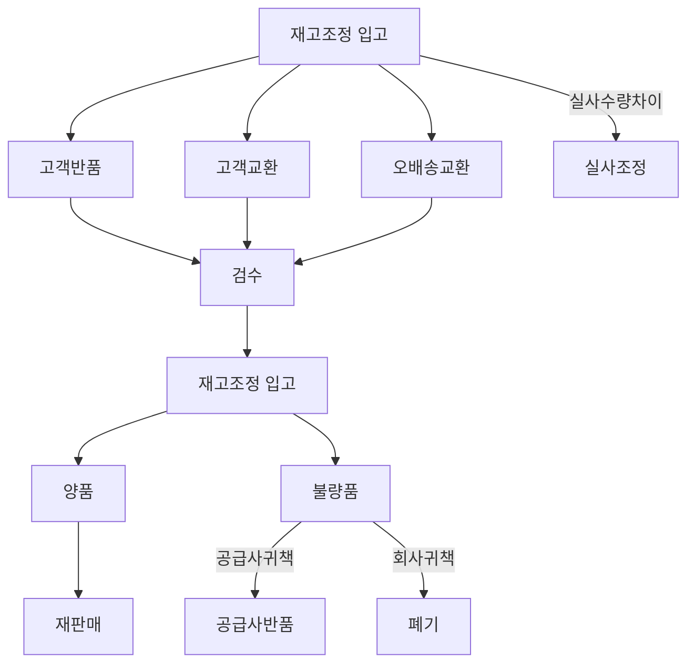
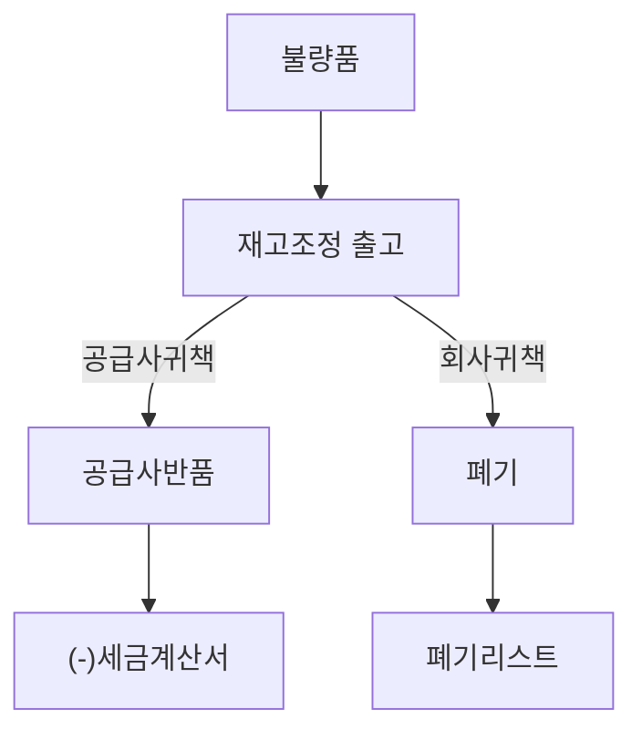

# 재고조정 프로세스

## 재고조정 원칙

1. 재고조정은 고객반품, 고객교환, 오배송교환, 실사조정, 공급사반품, 폐기의 사유로 재고 수량이 조정됨을 의미한다.
2. 상기 사유 외 재고수량 조정사항이 발생할 경우 재고수량 조정사유를 추가한 후 수량을 조정하여야 한다.
3. 고객반품은 매출액이 조정되어야 함. 따라서 원칙적으로 판매채널을 통해 반품 및 환불절차가 진행되어야 한다.

## 재고조정 입고

### 재고조정 입고 개요

- 재조조정 입고 시 기재사항 : | 입고사유 | 센터코드 | 상품명 | 입고일 | 입고수량 | 기존출고 주문번호 | 재출고 주문번호 |
- 재고조정 입고 사유는 고객반품, 고객교환, 오배송교환, 실사조정을 의미함.

|    내용    | 발생사유                                                                    |
| :--------: | --------------------------------------------------------------------------- |
|  고객반품  | 제품하자, 단순변심으로 구매를 취소한 경우                                   |
|  고객교환  | 제품하자등 사유로 일부 또는 전체 주문 제품을 교환하는 경우                  |
| 오배송교환 | 고객 주소 오기재, 송장부착 오류등 사유로 오배송되어 반품 후 재배송하는 경우 |
|  실사조정  | 재고실사 후 실사 수량차이를 반영하는 경우                                   |

### 재고조정 입고 흐름도

### 고객반품

- 검수 후 재고조정 입고 기재사항을 `고객반품`으로 기재하고 재고조정 입고
- 양품은 재판매, 불량품은 귀책에 따라 `공급사반품` 또는 `폐기`
- 환불절차 진행

### 고객교환

- 검수 후 재고조정 입고 기재사항을 `고객교환`으로 기재하고 재고조정 입고
- 양품은 재판매, 불량품은 귀책에 따라 공급사반품 또는 폐기
- PA에 기존주문서 복사(직접입력)하여 신규 주문서 생성
- 신규 생성 주문서번호는 입고시 기재사항인 `재출고 주문번호`에 기재

### 오배송교환

- 고객 주소 오기재, 송장 혼동 등 출고자의 human error로 인해 오배송된 경우
- 검수 후 재고조정 입고 기재사항을 `오배송교환`으로 기재하고 재고조정 입고
- PA에 기존주문서 복사(직접입력)하여 신규 주문서 생성
- 신규 생성 주문서번호는 입고시 기재사항인 `재출고 주문번호`에 기재

### 실사조정

- 재고실사 후 재고수량이 변경되는 경우 재고조정 입고 기재사항을 `실사조정`으로 기재하고 재고조정 입고
- 재고 수량 차이를 (+), (-) 입력

## 재고조정 출고

### 재고조정 출고 개요

- 재고조정 출고 시 기재사항 : | 출고사유 | 센터코드 | 상품명 | 출고일 | 출고수량 | 출고금액 | 출고단가 |
- 재고조정 출고는 공급사반품, 폐기를 의미함.

|    내용    | 발생사유                                                          |
| :--------: | ----------------------------------------------------------------- |
| 공급사반품 | 제품하자의 귀책사유가 공급사에 있어 공급사로 제품을 반품하는 경우 |
|    폐기    | 제품하자의 귀책사유가 회사에 있어 제품을 폐기하여야 하는 경우     |

### 재고조정 출고 흐름도

### 공급사반품

- 관련문서 : 공급사반품리스트
- 물류창고로 입고된 재고 중 불량품에 대한 처리
- 귀책사유가 공급사에 있는 경우 재고조정 출고 기재사항을 `공급사반품`으로 기재하고 재고조정 출고
- 출고 단가(금액)를 반드시 기재 --> **(-) 세금계산서 발행 대상**
- 공급사 반품 리스트의 반품 금액과 (-) 세금계산서 발행금액 일치 확인

### 폐기

- 관련문서 : 폐기리스트
- 물류창고로 입고된 재고 중 불량품 또는 유통기한 지난 재고에 대한 처리
- 귀책사유가 회사에 있는 경우 재고조정 출고 기재사항을 `폐기`로 기재하고 재고조정 출고
- 출고 단가(금액)를 반드시 기재 --> **폐기전표 입력 대상**
- 폐기리스트상 금액이 폐기전표와 일치 확인

### 기타 참고사항

- 고객교환, 오배송교환 등으로 재출고 되어야 하는 경우 PA에서 주문서를 새로 생성
- 새로운 주문서 생성시 기존 주문서를 복사하고 금액은 '0'으로 기재

## 향후 개선사항

- [ ] 정기적 폐기 리스트 reporting으로 폐기 최소화
- [ ] 정기적 재고실사
- [ ] 모든 반품, 교환 등 재고변동의 처리는 판매채널을 거치도록 하여 정산정보와 link되는 process 구축
