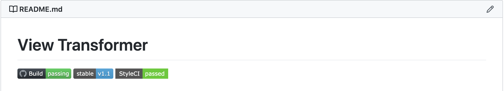

# 배포 가이드라인

ESC Company에서는 [Github](https://github.com/esc-company)을 저장소로 [Envoyer](https://envoyer.io/)를 통해 실서비스로 배포됩니다.

## Libraries

### 제작자

모든 코드는 테스트 코드가 작성되어야 하며, [StyleCI](https://styleci.io/)와 `Github Action`으로 검증되어야 합니다.



라이브러리도 예외는 아니며, 레포지토리 상단에 StyleCI와 Github Action의 Build 뱃지를 추가하며, 배포 준비가 되면 [packagist.org](https://packagist.org/)에 등록 요청을 같은 저장소의 Issue를 통해서 개발팀 매니저에게 요청합니다.

요청을 할 때 이 라이브러리를 필요로 하는 동료 개발자가 있다면 그 개발자 이름으로 Reference를 넣어서 알람이 가게 합니다.

### 매니저

개발팀 매니저는 요청받은 레포지토리를 `esc-company`를 prefix로 [packagist.org](https://packagist.org/)에 등록하고, packagist 뱃지를 README.md에 추가해야 한 후 Issue를 Close 합니다.

매니저는 다음 체크리스트를 확인합니다.

- [x] 버전이 제대로 기입되었는지 여부.
- [x] Build 오류가 있는지와 테스트 코드의 적정성 여부.
- [x] StyleCI를 통과했는지 여부.

### 라이브러리 이용자

라이브러리의 이용시에 문의나 코드 수정은 Issue와 PR 이외의 커뮤니케이션 수단은 사용할 수 없습니다.

또한, 그 라이브러리는 `composer.json`으로만 이용해야 합니다.

## Services

서비스의 배포는 Envoyer를 이용하며, 스토리지의 경우 로컬의 리소스를 서버에 rsync로 업로드 합니다.

```sh
rsync -arvuz --exclude=".gitignore" ....../storage/app/public/ username@111.111.111.111:/home/username/projectname/current/storage/app/public
```

rsync 스크립트를 만들기 전에 서버의 배포 경로를 먼저 조정해야 한다는 사실을 유념하세요.

### Stage Server

스테이지 서버는 깃헙 코드가 업데이트 되면 자동으로 서버에 전송되기 때문에 다른 절차는 필요하지 않습니다.

단, 스테이지 서버의 오픈이 필요하다면 미리 배포된 `envoy run stage-up` / `envoy run stage-down` 커맨드를 이용해서 필요한 기간만 이용해야 합니다.

사내 개발 환경은 로컬에서 실서비스와 동일한 환경을 valet과 composer만을 이용해서 제공하고 있습니다. 스테이지 서버는 반드시 다른 팀과 테스트가 필요할 때만 이용합니다.

오후 7시 이후에는 자동으로 스테이지 서버가 닫히니 참고하세요.


### Live Server

라이브 서버로의 배포는 Envoyer에서 수동으로만 배포하며, 배포 후에 아래의 리스트를 체크합니다.

- [x] Laravel Envoyer Heartbeat가 정상인지 여부.
- [x] Ohdear Monitoring 알람이 오지 않는지 여부.
- [x] Sentri 알람이 오지 않는지 여부.

10분이 기준이며, 셋 중 하나라도 이상이 생기면 바로 이전 배포 버전으로 다시 deplay 합니다.

## 데이터베이스

데이터베이스의 스키마를 수정하기 위해서 [Laravel Migration](https://laravel.com/docs/7.x/migrations) 기능은 사용하지 않습니다.

데이터베이스 스키마 수정 방법 :

| 타입               | 방법                                                   |
| :----------------- | :----------------------------------------------------- |
| 테이블 / 필드 추가 | Github 레퍼지토리의 Issue로 스키마 수정 논의를 거침.   |
| 필드 삭제          | 개발 DB에서 테스트 후 Issue로 스키마 수정 논의를 거침. |
| 테이블 삭제        | 테이블 삭제는 일반적으로 허용되지 않음.                |

## 배포용 서버

### 라라벨 프로젝트

[Forge](https://forge.laravel.com/)를 이용해서 설치하며, 그 이외의 방법은 허용되지 않습니다.

### 온프라미스

`Forge`를 사용할 수 없는 상황일 경우, 서버 세팅은 yum, apt 등 패키지매니저만을 이용하며, 컴파일 설치는 일반적으로 허용되지 않습니다. 스크립트 히스토리를 Github의 README.md 파일 첫 문단에 기록합니다.

### MSA

이미지 프록시와 같은 MSA들은 다음 두가지 중 하나의 배포방법을 이용할 수 있습니다.

- build.sh 스크립트 제작
- Docker 파일 제작

build.sh은 프로젝트의 `bin/` 폴더에 반드시 포함되어 있어야 합니다.

Docker 파일은 [Docker Hub](https://hub.docker.com/)에 등록하며, 배포파일을 별도로 관리하지 않습니다.