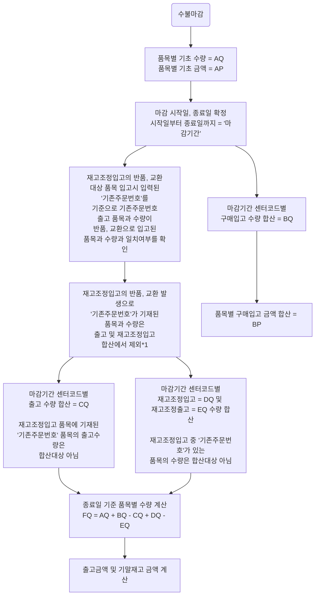
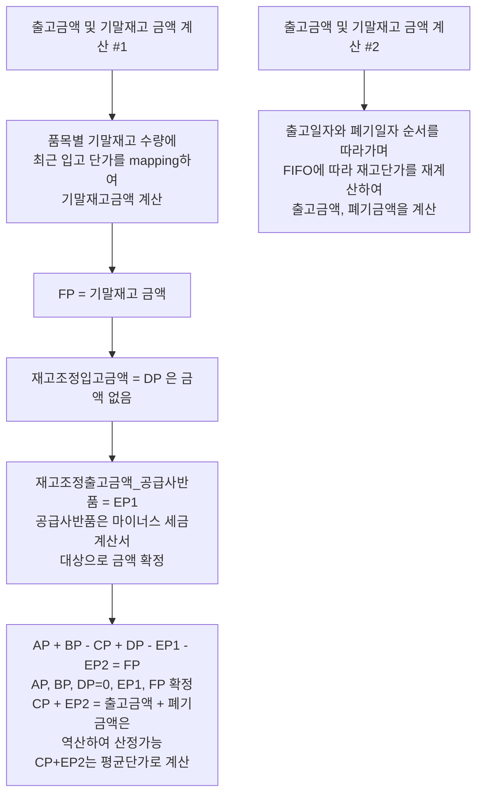

# 재고 수불부 마감 절차

## 원칙
1. 재고수불부는 월별 마감
2. 재고수불부 구조
	* 기초 + 구매입고 - 출고 + 재고조정입고 - 재고조정출고 = 기말
	* 수량과 금액 병기
3. 출고 기준은 PA의 수취확인 일자
4. 구매입고 기준은 GMS의 검수확인 일자
5. 재고 단가 산정기준은 FIFO(First In First Out)

## 마감 절차

### 흐름도

*1) 반품, 교환되는 품목의 경우 재입고시 기존 주문번호를 기재하고 재고조정입고됨. 기존 출고 및 반품, 교환 입고 수량을 상계하여 중복출고를 제외함.

