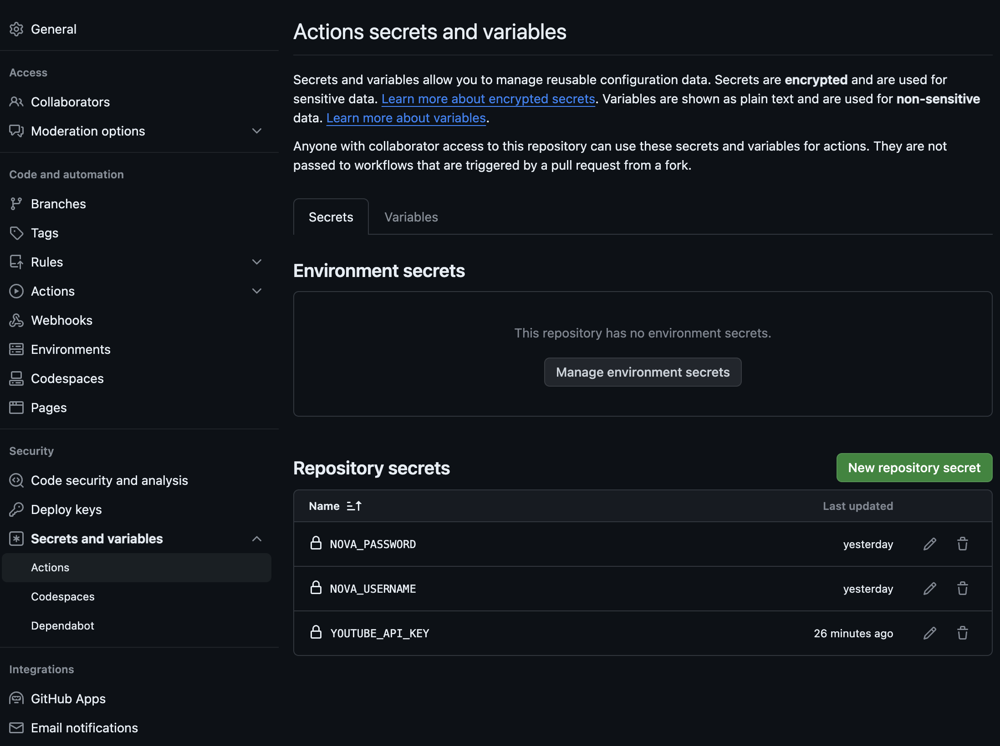

# 라라벨 .env 내용을 깃헙 액션으로 test에 적용하기

깃헙 액션으로 테스트를 구동할 때 .env의 외부키가 공개되는 이슈가 있을 수 있습니다. 예를 들어서 Youtube API에 접근하거나 Laravel Nova에 접근하기 위해서는 키가 필요한데요, 경우에 따라서 키를 사내에 혹은 외부에 공개할 수 없습니다.

이 경우 배포용 .env에 키를 넣지 않고 깃헙 설정에 secrets에 별도로 키를 저장할 수 있습니다.

본 팁에서는 유튜브와 Laravel Nova 두가지 시나리오를 설명합니다.

## Youtube API

테스트용 설정파일인 `.env.testing` 에 키를 넣습니다.

```env
YOUTUBE_API_KEY=
```

깃헙 액션의 테스트 스크립트에 아래의 코드를 추가합니다.

```yaml
      - name: Execute tests (Unit and Feature tests) via PHPUnit
        env:
          DB_CONNECTION: sqlite
          DB_DATABASE: database/database.sqlite
          YOUTUBE_API_KEY: ${{ secrets.YOUTUBE_API_KEY }}
        run: vendor/bin/phpunit ./tests
```

마지막으로 YOUTUBE_API_KEY 를 깃헙에 저장합니다. 해당 메뉴는 Setting > Secrets and variables > Actions 을 클릭하면 되며, `https://github.com/<아이디>/yt/settings/secrets/actions` 로 직접 접근할 수 있습니다.



이제 깃헙 액션을 실행할 때 해당 키가 적용되어 테스트를 할 수 있습니다.

## Laravel Nova

깃헙에서 테스트를 하기 위해서는 `composer install`을 실행하는데요, Laravel Nova의 키가 없으면 테스트를 진행할 수 없습니다. 따라서, Laravel Nova도 Youtube API와 마찬가지로 키를 위의 이미지에서 표기된 것 처럼 NOVA_USERNAME과 NOVA_PASSWORD를 저장합니다.

Laravel Nova에서 키를 확인하는 것은 3가지 방법이 있습니다.

1. .env에 NOVA_USERNAME과 NOVA_PASSWORD를 저장한다.
2. auth.json에 NOVA_USERNAME과 NOVA_PASSWORD를 저장한다.
3. http 인증 프로토콜을 이용해서 Laravel Nova 저장소에 접근한다.

자세한 내용은 [Laravel Nova Installation](https://nova.laravel.com/docs/installation.html) 문서를 참고하세요.

인증 내용을 깃헙에 저장했다면, 아래와 같이 테스트 스크립트를 수정합니다.

```yaml
      - name: Install Composer dependencies
        run: |
          composer config "http-basic.nova.laravel.com" "${{ secrets.NOVA_USERNAME }}" "${{ secrets.NOVA_PASSWORD }}"
          composer install --prefer-dist --no-interaction --no-progress
```

CI 단계에서 이 방법으로 키를 공개하지 않을 수 있으며, Laravel Envoyer나 Laravel Forge에서도 이와 같은 방법으로 공개할 수 없는 키를 안전하게 시스템에 반영할 수 있습니다.

오늘도 라라벨과 함께 행복하세요.
