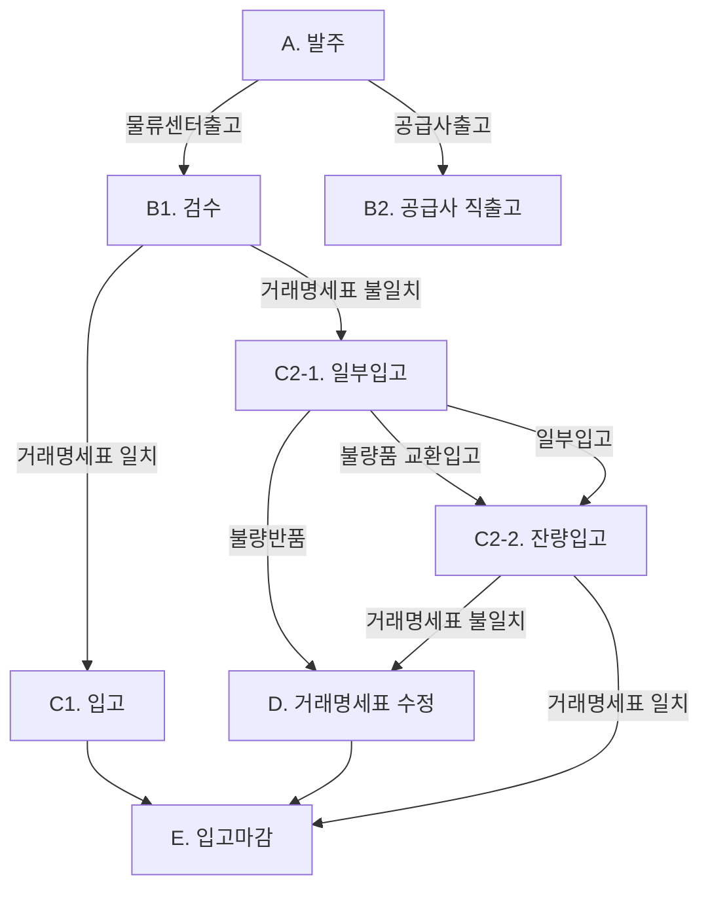

# 발주입고 프로세스

## 입고 원칙

1. 입고는 발주서를 통해 구매한 재고가 검수 후 물류센터 창고에 보관되는 구매입고를 의미한다.
2. 구매입고는 발주서 및 거래명세표가 존재하여야 한다.
3. 구매입고 수량과 금액은 거래명세표와 일치해야한다.
4. 구매입고 시 반드시 검수를 해야하며, 실제 입고일자에 검수 수량 및 금액이 입력되어야 한다.

## 입고 절차

### 흐름도

### 업무 내용

|  구분  |    내용    | 업무                                             |
| :--: | :------: | ---------------------------------------------- |
|   A  |    발주    | GMS에 발주정보(거래처, 품목, 수량, 금액)를 입력                 |
|  B1  |    검수    | 발주수량과 입고수량, 거래명세표를 대사하고 일치여부를 확인               |
|  B2  |  공급사 직출고 | 공급사에 구매정보 발송, 송장정보 PA입력                        |
|  C1  |    입고    | 검수 후 발주서와 입고수량, 거래명세표가 일치하면 GMS에 검수 수량과 금액을 입력 |
| C2-1 |   일부입고   | 불량, 일부미배송 등 일부품목만 입고 시 GMS에 일부 검수 수량과 금액을 입력   |
| C2-2 |   잔량입고   | 불량품 교환입고, 미배송 품목의 추가입고 시 GMS에 잔량 검수 수량과 금액을 입력 |
|   D  | 거래명세표 수정 | 불량반품, 잔량입고 후 발주서와 최종검수 수량의 차이가 있는 경우 거래명세표를 수정 |
|   E  |   입고마감   | 최종 입고수량과 금액은 거래명세표와 일치하여야 하며 일치 확인 후 입고를 마감    |

## 발주

* 관련문서 : 발주서
* 발주는 재고 부족 또는 부족이 예상될 경우 수행
* 발주 담당자는 발주서를 GMS에 입력
*   발주서는 발주자, 발주일, 공급사, 발주 품목/수량/단가/금액, 예정입고일을 기재한 문서

    **검수**
* 관련문서 : 거래명세표
* 공급사에서 물류센터로 발주품목이 도착한 경우 &#x20;
* 검수 담당자는 발주수량과 도착수량간 수량 차이여부를 대사
* 발주수량과 도착수량이 일치 :  검수 품목/수량과 거래명세표상 품목/수량의 일치여부를 확인 후 입고처리
* 발주수량과 도착수량이 불일치 : 차이원인 파악
  * 제품 하자 : 제품 불량 등 사유로 반품, 교환이 필요한 경우&#x20;
    * 반품 : 반품대상 품목을 제외하여 거래명세표를 수정하고, 검수 완료된 품목은 입고처리
    * 교환 : 검수 완료된 품목에 대해서는 입고처리하고, 교환대상 품목은 일부 미배송 처리       &#x20;
  * 일부 미배송 : 배송된 품목에 대해 검수절차를 완료하고 입고처리.
    * 입고 마감 : 일부 미배송 존재하는 발주건에 대해서는 입고 마감하지 않고 일부 미배송 상태로 전환
    * 잔여 품목 배송 : 일부 미배송상태인 발주 건은 잔여 품목이 입고된 경우 검수절차를 수행하여 입고처리

## 입고

* 관련문서 : 검수확인서
* 입고담당자는 검수 완료된 발주건에 대해 GMS에 거래처, 입고일, 검수자, 입고품목/수량/금액, 증정품여부, 배송비 금액을 입력
* 검수결과를 입력하면 검수확인서 생성&#x20;
* 검수확인서에 입력된 입고정보는 최종 거래명세표상 거래처, 품목, 수량, 금액과 일치하여야 함
* 검수확인서에는 입고 품목의 수량을 고려한 총 입고금액을 입력하며 품목당 단가는 자동계산됨
* 증정품의 경우 증정품여부 및 검수 수량을 기재하며, 금액은 '0'으로 입력
*   일부미배송의 경우 `입고중` 상태를 유지하며 잔량 입고된 경우 마감절차 진행

    **마감**
* 발주, 검수, 입고절차가 완료되면 입고 관련 문서를 보관(archive)하여 입고를 마감
* 관련 문서는 발주서, 검수확인서, 거래명세표를 의미

## 향후 개선사항

* [ ] 일별 재고 수량에 오차가 없을 경우 재고 수량과 연동하여 자동 발주 가능하도록 개선
* [ ] 정글북 재고의 경우 주문서 입력 시 자동으로 발주되도록 개선
