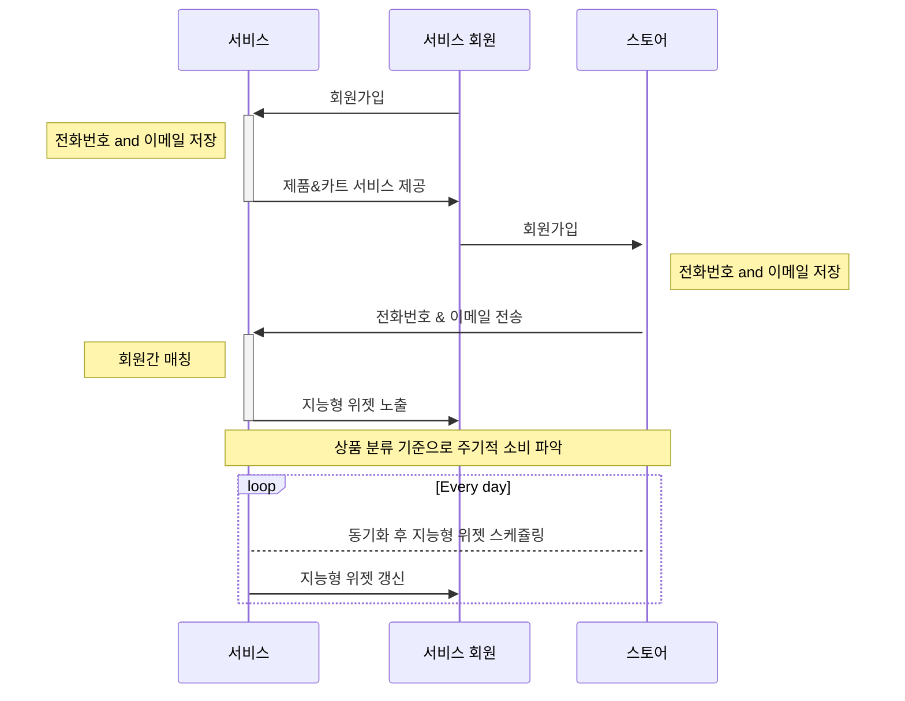
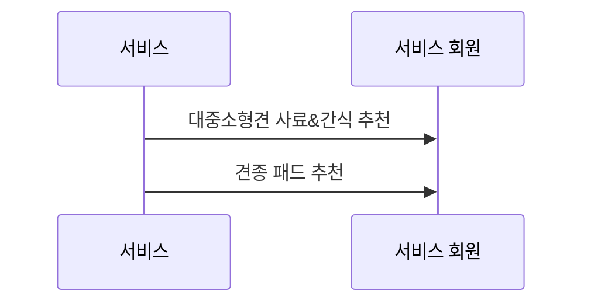
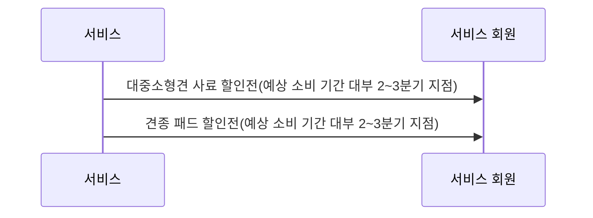
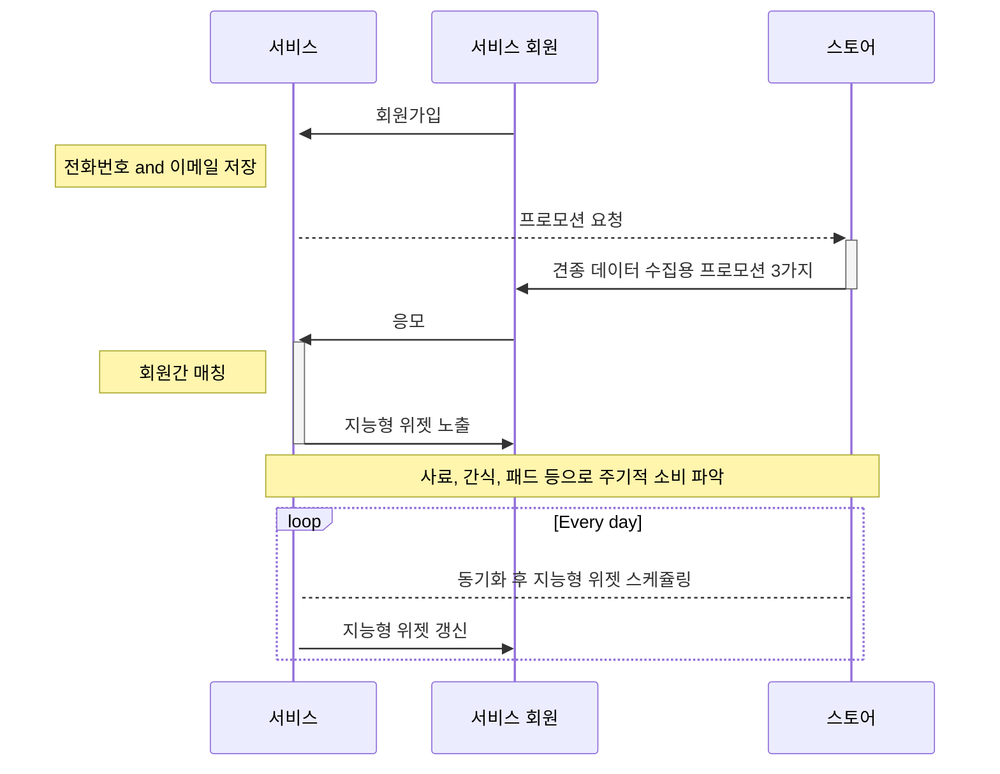

- [서비스와 스토어 중복 회원](#서비스와-스토어-중복-회원)
  - [지능형 위젯](#지능형-위젯)
- [서비스만 회원](#서비스만-회원)

## 서비스와 스토어 중복 회원

서비스와 스토어 시퀀스 다이어그램:

### 지능형 위젯

- 정기적인 소비가 일어나는 상품이나 소비가 일어날 필요가 있는 상품을 미리 연산 후 추천.
- 특정 고객에게 확실한 소비가 일어날 가능성이 있는 상품의 프로모션 쿠폰을 전달.

| 채널       | 설명                                     | 단점                          |
| ---------- | ---------------------------------------- | ----------------------------- |
| 아웃바운드 | 리모트 노티피케이션, 이메일, SMS, 알림톡 | 수신 여부를 확실히 알 수 없음 |
| 인바운드   | 서비스 1탭 두번째 혹은 세번째 섹션       | 위젯 공간을 놓칠 수 있음      |

미래 소비 상품**군** 예측:

미래 소비 상품**군** 프로모션:

## 서비스만 회원

서비스 시퀀스 다이어그램:

아후 프로세스는 `서비스와 스토어 중복 회원`과 같음
